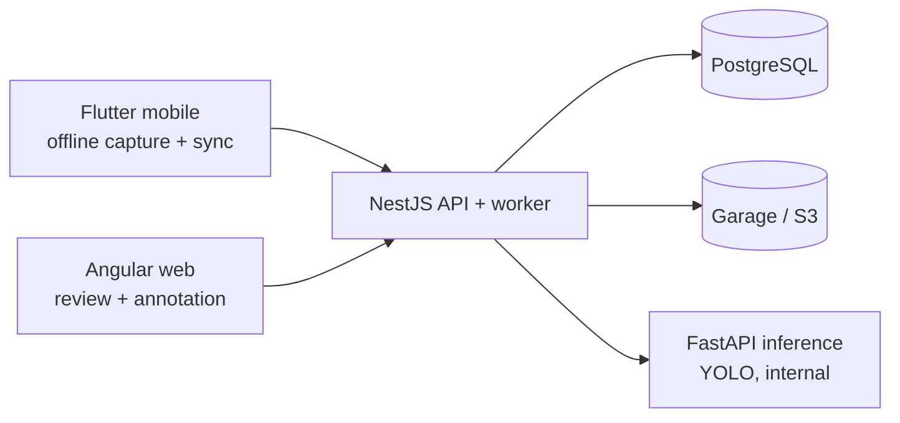

# AgroLens (monorepo)

Field image capture, upload processing, annotation, and YOLO dataset export for agriculture.

Node projects use pnpm workspaces and Turborepo; Flutter and Python projects have their own toolchains.

## Layout

```
AgroLens/
├── apps/
│   ├── api/            # NestJS 11 API + worker (auth, catalogs, uploads,
│   │                   # annotations, access, inference jobs, admin)
│   ├── web/            # Angular 20 web app (review, annotation, YOLO export)
│   └── mobile/         # Flutter app (offline field capture + sync)
├── services/
│   └── inference/      # FastAPI YOLO service (internal, CPU-only)
├── packages/
│   ├── contracts/      # @agrolens/contracts — Zod schemas + inferred TS types
│   ├── tsconfig/       # shared strict TS presets
│   └── eslint-config/  # shared flat ESLint + Prettier baseline
├── deploy/             # docker-compose.dev.yml + production/ (Compose, Caddy, systemd)
├── docs/               # architecture, recovery, and cross-app testing
├── scripts/            # repo scripts
└── .github/workflows/  # ci.yml (turbo) + mobile.yml + inference.yml
```

## Architecture



`apps/api` serves the API and the background worker from one process (`src/main.ts`),
applies runtime migrations on boot (PostgreSQL advisory lock), and serves the built
Angular SPA in production via `WEB_DIST_PATH`.

## Prerequisites

- Node.js 22+, pnpm 10 (`corepack enable`), Docker + Compose v2
- Flutter 3.12+ for `apps/mobile`, Python 3.11 for `services/inference`

## Quick start

```bash
corepack enable
pnpm install

# shared contracts first (api + web depend on it)
pnpm --filter @agrolens/contracts build

# local services (PostgreSQL + Garage) + API/worker
cd deploy
docker compose -f docker-compose.dev.yml up -d --build --wait postgres garage api

# seed first admin (ADMIN_* env required, see apps/api/.env.example)
cd ../apps/api
cp .env.example .env   # then edit ADMIN_EMAIL / ADMIN_PASSWORD
pnpm db:seed:first-admin
```

- API: `http://localhost:3000/api` · Swagger: `http://localhost:3000/docs` (when enabled)
- Web dev: `cd apps/web && pnpm start` → `http://localhost:4200` (proxies `/api`)
- Mobile: `cd apps/mobile && flutter run --dart-define=API_BASE_URL=http://localhost:3000/api`
- Inference (optional, internal): see `services/inference/README.md`

`S3_PUBLIC_ENDPOINT` must be browser/device reachable (locally `http://localhost:3900`);
`S3_ENDPOINT` may be Docker-internal (`http://garage:3900`).

## API contracts

Clients use the shared contract:

- Pagination: `?limit=&offset=` on every paginated list (`{ items, total }` envelope).
  Mobile still accepts legacy `page/pageSize` and collection-key aliases.
- Admin routes live under `/api/admin/...`.
- Web imports request/response types from `@agrolens/contracts`; do not hand-write
  DTO mirrors. Mobile (Dart) keeps hand-written models with an envelope-tolerant
  `extractItems` helper.

## Validation

```bash
pnpm turbo run lint typecheck test build   # all Node workspaces
pnpm --filter @agrolens/api test:e2e       # API E2E (needs postgres + garage + seed)
cd apps/web && pnpm e2e                     # Playwright, real backend (needs full stack)
cd apps/mobile && flutter analyze && flutter test
cd services/inference && pip install -r test-requirements.txt && python -m pytest tests/ -v
```

Production compose check:

```bash
cd deploy/production && docker compose -f docker-compose.prod.yml --env-file .env.example config --quiet
```

## Guides

- [Architecture and client responsibilities](docs/architecture.md)
- [Backend](apps/api/README.md), [web](apps/web/README.md), [mobile](apps/mobile/README.md), and [inference](services/inference/README.md)
- [Production deployment](deploy/production/README.md) and [backup/restore](docs/operations/backup-restore.md)
- [Cross-app E2E](docs/testing/cross-app-e2e.md) and [contributing](CONTRIBUTING.md)

## Security / License

See `SECURITY.md`. Never commit `.env` files, secrets, signing keys, or build output.
Apache-2.0 — see `LICENSE`.
